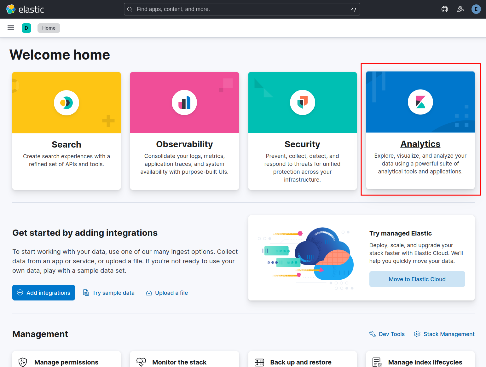

# Local Docker Development Logging Stack

## Description

The stack monitors your local Docker installation and collects the output from stdout and stderr for all your containers.
There is no need to adjust the logging from service in other Docker Compose projects. The stack is going to collect all
logs, as long the container itself maps the **output** to `/dev/stdout` and the **error to `/dev/stderr`. 

Components:
- Filebeat
- Elasticsearch
- Kibana

## Supported Systems
- Linux
- MacOS with Docker Desktop


## Installation

Create the .env file
```shell
cp .env.example .env
```

Since Filebeat monitors the local Docker installation ("root" user) the filebeat.yml needs to be owned by "root" (uid=0):
If the filebeat.yml config file permissions are wrong, the container won't start and fails with the following error:

`Error: Exiting: error loading config file: config file ("filebeat.yml") must be owned by the user identifier (uid=0) or root`

```shell
sudo chown root .docker/filebeat/filebeat.yml 
```

Start the logging stack

```shell
docker compose up -d
```

## Usage

### Kibana Dashboard

- URL: http://localhost:5601
- User: elastic
- Password: changeme 

### Initial Kibana Setup 

The following steps only need to be followed on the initial setup.


Explore the dasboard on your own.


Go to Analytics


Create a Kibana data view


The data view musst have a meaningful "name", a "index pattern" (1) and a matching Index (2).
Save the data view (3).


Go to Analytics->Discover


Start analysing your logs.

After the stack is up and running, the stdio of all containers will be collected and logged.

## Customizations

### Ignore Containers for Logging
If containers should be ignored completely for logging the following label can be added to each service:

```yaml
# Service in an other docker-compose project
service:
  my-service:
    labels:
      co.elastic.logs/enabled: false
```


## Credits

The main parts of the stack were taken from here: https://github.com/elkninja/elastic-stack-docker-part-one
I've reduced the complexity of the original stack to the minimal required components.